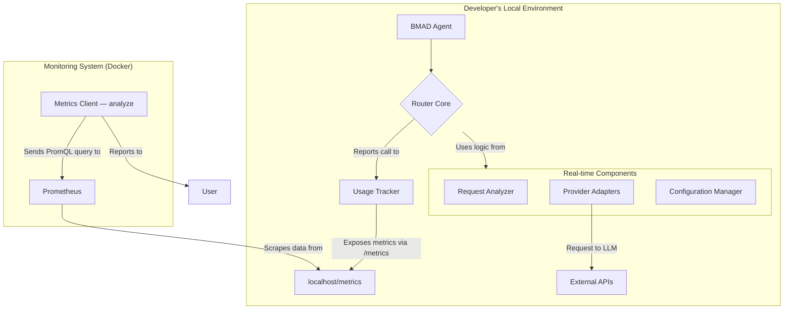
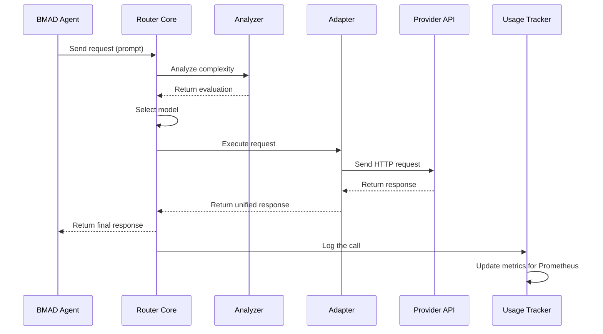

# Architecture Document: BMAD Intelligent Model Router (v2.2)

## 1. High-Level Architecture

**Core Principle:** The router is not an external cloud service but a **core library** embedded directly into the BMAD-METHOD toolkit. It runs locally on each developer's machine.

### Platform and Infrastructure

**Cloud providers are not required for the router itself to function.**

- **Execution Environment:** A developer's local machine with Node.js installed.
- **Requirements:** Internet access is required to call cloud-based LLM APIs.

### Configuration for Teamwork

- **Router Core:** The logic resides in the BMAD-METHOD repository (`.bmad-core/router/`).
- **Shared Configuration:** The `.bmad-core/config/router.config.yml` file contains the "model matrix" and rules; it is versioned in Git to ensure team consistency.
- **Personal Settings:** API keys are stored in a local `.env` file, which is ignored by Git.

### Architecture Diagram



## 2. Technology Stack

### Category Technology Version Purpose Rationale

| Category | Technology | Version | Purpose | Rationale |
| :--- | :--- | :--- | :--- | :--- |
| **Core Language** | TypeScript | ~5.3.3 | Development of all router logic. | Ensures reliability and strong typing. |
| **Runtime Environment** | Node.js | ^18.0 \|\|^20.0 | | |
| **API Client** | Axios | ^1.6.0 | Executing HTTP requests to LLM APIs. | A reliable and popular HTTP client. |
| **Configuration Format** | YAML & dotenv | - | Storing shared configuration and keys. | YAML is readable, dotenv is standard for secrets. |
| **Testing** | Jest | ^29.7.0 | Writing unit and integration tests. | A powerful framework for testing. |
| **Metrics Collection** | prom-client | ^15.1.0 | Creating the /metrics endpoint for Prometheus. | The standard library for Node.js. |
| **Analytics System** | Prometheus | - | Centralized collection and processing of metrics. | A powerful and extensible solution. |

## 3. Components and Workflows

### Components

1.  **Configuration Manager:** Reads `router.config.yml` and `.env`.
2.  **Router Core:** Receives the request and manages the process.
3.  **Request Analyzer:** Determines the intent and complexity of the request.
4.  **Provider Adapters:** Modules for communicating with each LLM API.
5.  **Usage Tracker:** Updates metrics and exposes them via `/metrics`.
6.  **Metrics Client (MetricsBot):** A CLI command (`analyze`) that queries the Prometheus API.

### Key Workflow

The sequence diagram shows the automatic routing of a request.



## 4. Code Structure and Standards

### Code Structure

```Plaintext
.bmad-core/
└── llm-router/
    ├── src/
    │   ├── adapters/
    │   ├── config/
    │   ├── core/
    │   ├── metrics/
    │   ├── types/
    │   └── index.ts
    ├── tests/
    └── package.json
```

### Critical Coding Rules

1.  Access to settings is only through the Configuration Manager.
2.  Interaction with LLM APIs is only through Adapters.
3.  Storing API keys in the code is forbidden.
4.  Every call must be logged via the Usage Tracker.

## 5. Infrastructure and Testing

-   **Infrastructure:** Local monitoring stack (Prometheus/Grafana) based on Docker.
-   **Testing:** Unit tests for each component and integration tests to verify interactions. The AI agent is required to create tests for new code.
