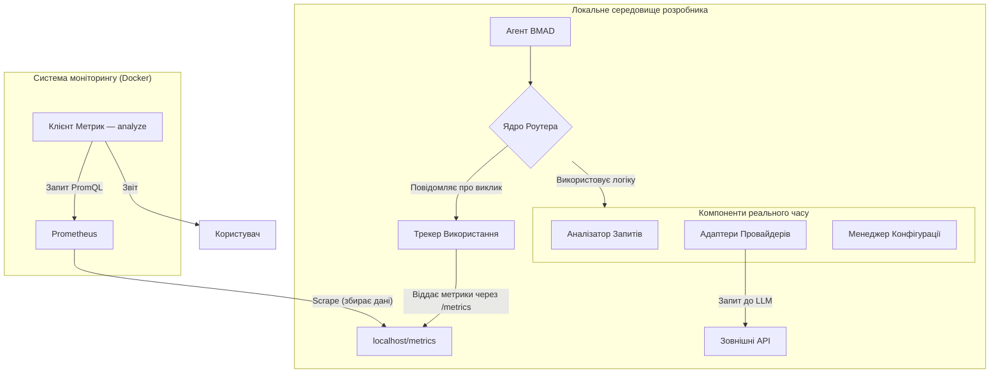
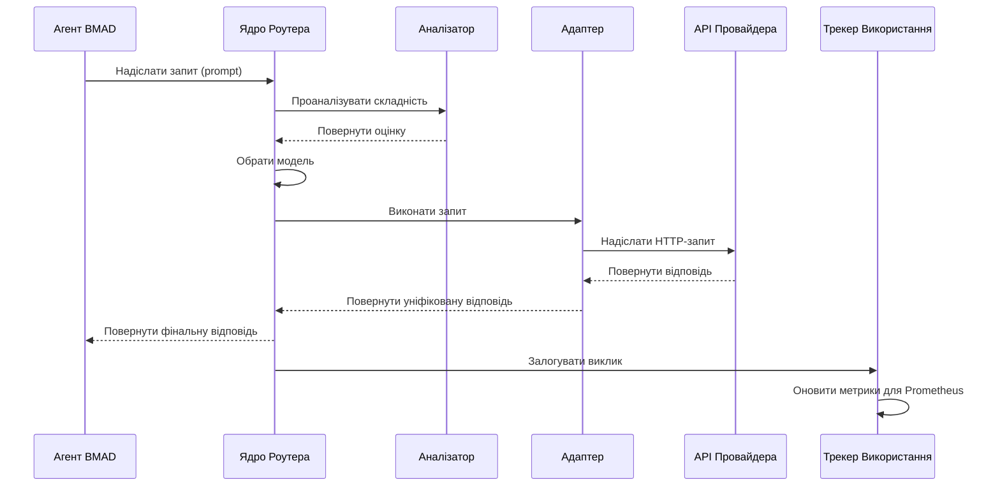

# Architecture Document: Інтелектуальний маршрутизатор моделей BMAD (v2.2)

## 1. Архітектура високого рівня

**Основний принцип:** Роутер — це не зовнішній хмарний сервіс, а **основна бібліотека (core library)**, вбудована безпосередньо в інструментарій BMAD-METHOD. Він виконується локально на машині кожного розробника.

### Платформа та інфраструктура

**Хмарні провайдери не потрібні для роботи самого роутера.**

- **Середовище виконання:** Локальна машина розробника з встановленим Node.js.
- **Вимоги:** Наявність доступу до мережі Інтернет для звернення до хмарних LLM API.

### Конфігурація для командної роботи

- **Ядро роутера:** Логіка знаходиться у репозиторії BMAD-METHOD (`.bmad-core/router/`).
- **Спільна конфігурація:** Файл `.bmad-core/config/router.config.yml` містить "матрицю моделей" та правила; він версіонується в Git для узгодженості роботи команди.
- **Персональні налаштування:** API-ключі зберігаються в локальному файлі `.env`, який ігнорується Git.

### Діаграма архітектури



## 2. Технологічний стек

### Категорія Технологія Версія Призначення Обґрунтування

| Категорія            | Технологія    | Версія          | Призначення                                  | Обґрунтування                                     |
| -------------------- | ------------- | --------------- | -------------------------------------------- | ------------------------------------------------- |
| Основна мова         | TypeScript    | ~5.3.3          | Розробка всієї логіки роутера.               | Забезпечує надійність та строгу типізацію.        |
| Середовище виконання | Node.js       | ^18.0 \|\|^20.0 |                                              |                                                   |
| Клієнт для API       | Axios         | ^1.6.0          | Виконання HTTP-запитів до API LLM.           | Надійний та популярний HTTP-клієнт.               |
| Формат конфігурації  | YAML & dotenv | -               | Зберігання спільної конфігурації та ключів.  | YAML читебельний, dotenv — стандарт для секретів. |
| Тестування           | Jest          | ^29.7.0         | Написання unit- та інтеграційних тестів.     | Потужний фреймворк для тестування.                |
| Збір метрик          | prom-client   | ^15.1.0         | Створення /metrics ендпоінту для Prometheus. | Стандартна бібліотека для Node.js.                |
| Система аналітики    | Prometheus    | -               | Централізований збір та обробка метрик.      | Потужне та розширюване рішення.                   |

## 3. Компоненти та робочі процеси

### Компоненти

1. Менеджер Конфігурації: Читає router.config.yml та .env.
2. Ядро Роутера: Приймає запит, керує процесом.
3. Аналізатор Запитів: Визначає намір та складність запиту.
4. Адаптери Провайдерів: Модулі для комунікації з кожним LLM API.
5. Трекер Використання: Оновлює метрики та віддає їх через /metrics.
6. Клієнт Метрик (MetricsBot): CLI-команда (*analyze), що робить запити до Prometheus API.

### Ключовий робочий процес

Діаграма послідовності показує автоматичну маршрутизацію запиту.

Фрагмент коду



## 4. Структура коду та стандарти

### Структура коду

```Plaintext
.bmad-core/
└── llm-router/
    ├── src/
    │   ├── adapters/
    │   ├── config/
    │   ├── core/
    │   ├── metrics/
    │   ├── types/
    │   └── index.ts
    ├── tests/
    └── package.json
```

Критичні правила кодування

1. Доступ до налаштувань — тільки через Менеджер Конфігурації.
2. Взаємодія з LLM API — тільки через Адаптери.
3. Заборонено зберігати API-ключі в коді.
4. Кожен виклик має бути залогований через Трекер Використання.

## 5. Інфраструктура та тестування

- Інфраструктура: Локальний стек моніторингу (Prometheus/Grafana) на базі Docker.
- Тестування: Unit-тести для кожного компонента та інтеграційні тести для перевірки взаємодії. AI-агент зобов'язаний створювати тести для нового коду.
