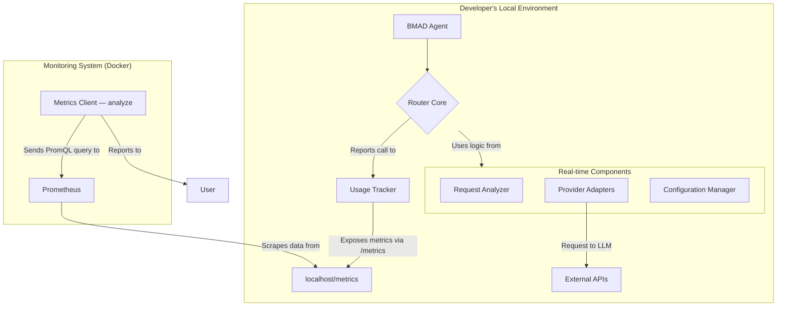
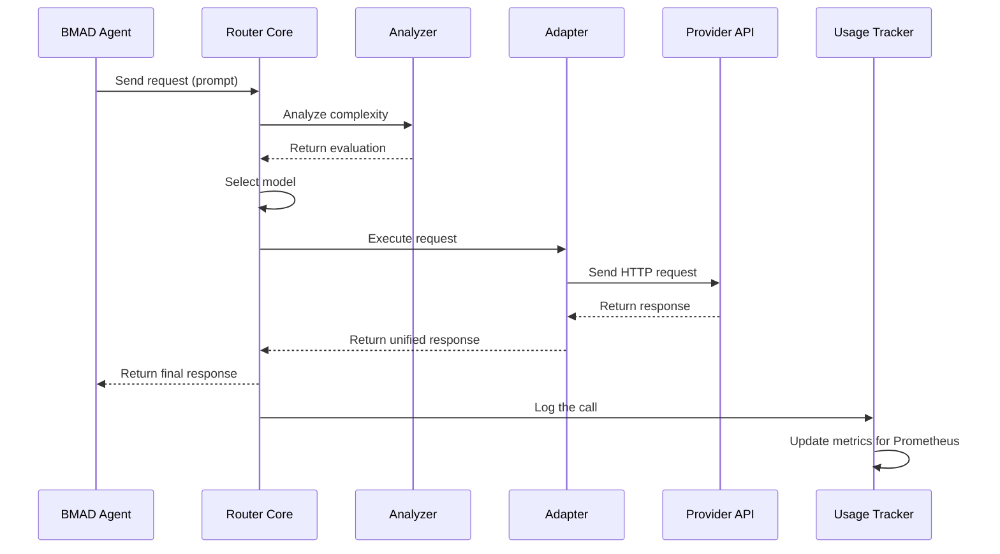

Of course. Here are the English translations of the documentation files.

### 1. `brief-claud-code-choise-model.md`

# Briefing Document: Optimizing Claude Code Usage Through Manual Model Selection

**Main Topics and Key Ideas:**

This document examines the key aspects of using Claude Code, focusing on its default model selection behavior and strategies for optimizing cost and efficiency.

**1. Drawbacks of Claude Code's Default Settings:**

* **Lack of intelligent model selection by default:** Claude Code always directs requests through its most powerful and expensive model—Opus 4. As noted, "by default, Claude code always routes your request through Anthropic's most powerful model, Opus 4." This occurs regardless of the request's complexity.
* **High cost of Opus 4:** Opus 4 is five times more expensive than Sonnet 4. "Opus 4 is five times more costly than Sonnet 4." This leads to significant token overspending and reaching usage limits quickly.
* **Reactive model switching:** Claude Code only switches to Sonnet 4 when "your usage approaches 20% of your allocated quota." This switch is not strategic but merely reactive, occurring when the user is "running out of capacity." This switching threshold has changed (from 100% to 50%, and then to 20%), indicating Anthropic's attempts to find a balance.
* **Comparison with other tools:** Unlike Claude Code, "other tools, such as Cursor, offer intelligent model switching by default," optimizing performance and cost.

**2. Demonstration of Default Settings' Inefficiency:**

* An experiment conducted with a simple query "what is 1 + 1" showed a significant cost difference:
    * Using Opus 4 (default): 25 cents.
    * Using Sonnet 4 (manual selection): 5 cents.
* **Key takeaway:** "there is no added value in using Opus 4 for this type of task. The answer is the same, and the complexity is minimal." This highlights that an "Opus 4 run is about five times more expensive than a Sonnet 4 run" but does not provide better results for simple tasks.

**3. Importance of Manual Model Selection:**

* **Cost optimization:** Manual model selection allows you to "get more from your usage" and "avoid wasting tokens."
* **Matching the model to the task:** It allows you to use the "right level of performance for your task without burning tokens unnecessarily."

**4. How to Choose a Model Effectively:**

* **General rule:**
    * **Opus 4:** Use for tasks requiring "reasoning, problem-solving, or anything that would make you stop and think." Examples: complex algorithm design, debugging difficult trace issues, architectural planning, code optimization, significant refactoring.
    * **Sonnet 4 (or older models):** Use for more "procedural" tasks where the model just needs to "follow clear instructions." Examples: simple implementation, code generation from a clear plan, writing documentation and comments, fixing minor syntax and formatting errors.
* **The paradoxical effect of powerful models:** "Ironically, using a more powerful model does not always mean better results." For simple tasks, Opus 4 might "over-analyze the request," looking for depth that isn't there, which can lead to "overly complex, overly abstract, or even just plain wrong solutions." A lighter model like Sonnet 4 "will give you cleaner, more direct answers."

**5. Common Concerns and Strategies to Address Them:**

* **"This adds an extra step to my workflow":** It's a trade-off: "you are trading a bit of your time to save a significant number of tokens." If you frequently hit your limits, manual selection is worth it.
* **"Sonnet 4 doesn't understand my codebase as well as Opus 4":** While Opus 4 is better at handling complex logic and large codebases, Sonnet 4 can still be used effectively with a few strategies:
    * **Thinking mode:** Prompt Sonnet 4 to enter "thinking mode" by literally typing "think hard" in the prompt. This encourages the model to "think through the problem more thoroughly."
    * **More precise model guidance:** Be specific in your requests. Specify files/functions to focus on, and provide examples to follow. Structure requests around "one clearly defined and independent part of the codebase."
    * **Hybrid approach: Opus 4 for planning, Sonnet 4 for execution:**
        * **Planning with Opus 4:** Use Opus 4 for complex reasoning, such as understanding the codebase, designing system architecture, creating an implementation plan, developing a testing strategy, identifying edge cases, and compiling a task list.
        * **Execution with Sonnet 4:** For each item in the plan, switch to a new chat with Sonnet 4, copy the relevant context (implementation plan, system design, specific task), and use Sonnet 4 to perform that part of the work. Once completed, clear the context and repeat for the next task. This approach "gives you the best of both worlds."

**Key Conclusions:**

* The current default behavior of Claude Code leads to significant and unnecessary token costs due to the constant use of the expensive Opus 4 model, even for simple tasks.
* Anthropic will likely introduce a more intelligent model selection system in the future, but for now, this feature is absent.
* Active manual model selection (Opus 4 for complex reasoning, Sonnet 4 for procedural tasks) is the best way to optimize workflow, save costs, and get the most out of Claude Code.
* Even for complex tasks, Sonnet 4 can be used effectively through strategies like thinking mode, more precise instructions, and a hybrid approach with Opus 4 for planning.
```

---

### 2. `docs/architecture.md`

```markdown
# Architecture Document: BMAD Intelligent Model Router (v2.2)

## 1. High-Level Architecture

**Core Principle:** The router is not an external cloud service but a **core library** embedded directly into the BMAD-METHOD toolkit. It runs locally on each developer's machine.

### Platform and Infrastructure

**Cloud providers are not required for the router itself to function.**

- **Execution Environment:** A developer's local machine with Node.js installed.
- **Requirements:** Internet access is required to call cloud-based LLM APIs.

### Configuration for Teamwork

- **Router Core:** The logic resides in the BMAD-METHOD repository (`.bmad-core/router/`).
- **Shared Configuration:** The `.bmad-core/config/router.config.yml` file contains the "model matrix" and rules; it is versioned in Git to ensure team consistency.
- **Personal Settings:** API keys are stored in a local `.env` file, which is ignored by Git.

### Architecture Diagram



## 2. Technology Stack

### Category Technology Version Purpose Rationale

| Category | Technology | Version | Purpose | Rationale |
| :--- | :--- | :--- | :--- | :--- |
| **Core Language** | TypeScript | ~5.3.3 | Development of all router logic. | Ensures reliability and strong typing. |
| **Runtime Environment** | Node.js | ^18.0 \|\|^20.0 | | |
| **API Client** | Axios | ^1.6.0 | Executing HTTP requests to LLM APIs. | A reliable and popular HTTP client. |
| **Configuration Format** | YAML & dotenv | - | Storing shared configuration and keys. | YAML is readable, dotenv is standard for secrets. |
| **Testing** | Jest | ^29.7.0 | Writing unit and integration tests. | A powerful framework for testing. |
| **Metrics Collection** | prom-client | ^15.1.0 | Creating the /metrics endpoint for Prometheus. | The standard library for Node.js. |
| **Analytics System** | Prometheus | - | Centralized collection and processing of metrics. | A powerful and extensible solution. |

## 3. Components and Workflows

### Components

1.  **Configuration Manager:** Reads `router.config.yml` and `.env`.
2.  **Router Core:** Receives the request and manages the process.
3.  **Request Analyzer:** Determines the intent and complexity of the request.
4.  **Provider Adapters:** Modules for communicating with each LLM API.
5.  **Usage Tracker:** Updates metrics and exposes them via `/metrics`.
6.  **Metrics Client (MetricsBot):** A CLI command (`analyze`) that queries the Prometheus API.

### Key Workflow

The sequence diagram shows the automatic routing of a request.



## 4. Code Structure and Standards

### Code Structure

```Plaintext
.bmad-core/
└── llm-router/
    ├── src/
    │   ├── adapters/
    │   ├── config/
    │   ├── core/
    │   ├── metrics/
    │   ├── types/
    │   └── index.ts
    ├── tests/
    └── package.json
```

### Critical Coding Rules

1.  Access to settings is only through the Configuration Manager.
2.  Interaction with LLM APIs is only through Adapters.
3.  Storing API keys in the code is forbidden.
4.  Every call must be logged via the Usage Tracker.

## 5. Infrastructure and Testing

-   **Infrastructure:** Local monitoring stack (Prometheus/Grafana) based on Docker.
-   **Testing:** Unit tests for each component and integration tests to verify interactions. The AI agent is required to create tests for new code.
```

---

### 3. `docs/prd.md`

```markdown
# PRD: BMAD Intelligent Model Router (Version 2.0)

## 1. Goals and Context

### Goals (Expanded)

* **For the user:** To radically reduce the cost of using **any LLM models (Anthropic, Gemini, OpenAI, as well as local ones running via Ollama or similar)** by automatically selecting the most cost-effective and productive model for each specific request, while maintaining high-quality results.
* **For the product (BMAD-METHOD):** To create a universal, intelligent LLM gateway that will become a central component of the BMAD ecosystem. This will provide users with unique flexibility, cost control, and the ability to use the best tools from different providers (including local models for maximum privacy and speed) for any task.

### Context

The initial analysis revealed the inefficiency of using a single model for all tasks. This extension recognizes that the problem is not limited to one provider. The modern AI landscape offers a multitude of models, each with its own strengths and costs. BMAD users should not be tied to a single provider or have to manually juggle different tools. This PRD describes the creation of a unified system that abstracts away the complexity of choice and delivers the best result at the best price, regardless of the model's source.

### Change Log

| Date | Version | Description | Author |
| :--- | :--- | :--- | :--- |
| 15.06.2025 | 1.0 | Initial draft for a binary Claude router | PM |
| **15.06.2025** | **2.0** | **Expansion to a multi-provider LLM gateway (OpenAI, Gemini, Ollama)** | **PM** |

## 2. Requirements

### Functional Requirements (FR)

* **FR1: Request Complexity Analysis:** The system must automatically analyze each user request before sending it to determine its intent and complexity.
* **FR2: Intelligent Routing (Multi-model):** Based on the analysis, the system must automatically route the request to the best model from the **entire pool of connected providers (Anthropic, OpenAI, Gemini, local)**, considering their capabilities, cost, and current load.
* **FR3: Manual Control (Expanded):** The user must be able to easily select a **provider and a specific model** (e.g., `OpenAI: GPT-4o`, `Local: Llama3`) for their request.
* **FR4: Transparency and Reporting:** The interface must clearly show **which provider and which model** were used.
* **FR5: Automated Hybrid Mode (Multi-model):** The system should allow using the **best model for planning** (e.g., `Claude 3 Opus` or `GPT-4o`) and the **best model for execution** (e.g., `Gemini 1.5 Flash` or local `Llama3`) within a single task.
* **FR6: Customizable Strategies:** The user can choose one of the pre-configured strategies.
* **FR7: Connection to API Providers:** The system must support authentication and sending requests to the APIs of Anthropic, OpenAI, and Google (Gemini).
* **FR8: Connection to Local Models:** The system must support connections to local servers operating on the Ollama standard.
* **FR9: Key and Endpoint Management:** The user must have a secure interface for entering their API keys for cloud providers and the endpoint address for a local server.
* **FR10: Configurable Model Matrix:** The system must use a configuration file that describes the capabilities, relative cost, and strengths of each model to make routing decisions.

### Non-Functional Requirements (NFR)

* **NFR1: Performance:** Routing latency must be minimal.
* **NFR2: Selection Reliability:** The system must select the optimal model from the entire pool with high reliability.
* **NFR3: Cost Savings:** The primary goal is a significant reduction in overall costs.
* **NFR4: Integration:** Deep integration into the BMAD-METHOD core.
* **NFR5: Extensibility:** The architecture must allow for the easy addition of new providers or models in the future with minimal code changes.

## 3. Epics

### Epic 1: Multi-Provider Integration Core

**Goal:** To create a unified layer for interacting with various LLM providers and configuring their connections.

* **Story 1.1:** Create a UI for securely entering and storing API keys for OpenAI, Anthropic, Gemini, and a URL for Ollama.
* **Story 1.2:** Implement a unified adapter that can send requests to and receive responses from the OpenAI API.
* **Story 1.3:** Extend the adapter to support the Anthropic API.
* **Story 1.4:** Extend the adapter to support the Google Gemini API.
* **Story 1.5:** Extend the adapter to support a local Ollama server.
* **Story 1.6:** Update the UI for manual model selection to show all configured models, grouped by provider.

### Epic 2: Intelligent Routing Engine v1

**Goal:** To implement the basic logic for automatically selecting the best model from all available options.

* **Story 2.1:** Create a configuration file (model matrix) that describes the characteristics of each model (cost, speed, strengths: code, creativity, analysis).
* **Story 2.2:** Implement a request analyzer that determines intent and complexity.
* **Story 2.3:** Create the core of the routing engine that, based on the request analysis and the model matrix, selects the best option.
* **Story 2.4:** Integrate the engine into BMAD so that automatic mode works by default.

### Epic 3: Advanced Strategies and Hybrid Mode

**Goal:** To provide users with powerful tools for complex tasks and flexible management.

* **Story 3.1:** Implement support for customizable strategies ("Savings," "Quality," "Balanced") in the routing engine.
* **Story 3.2:** Implement a hybrid mode that allows selecting one model for "Planning" (e.g., `GPT-4o`) and another for "Execution" (e.g., `Llama3`).
* **Story 3.3:** Implement a savings visualization that shows the user how much money was saved thanks to intelligent routing.
```